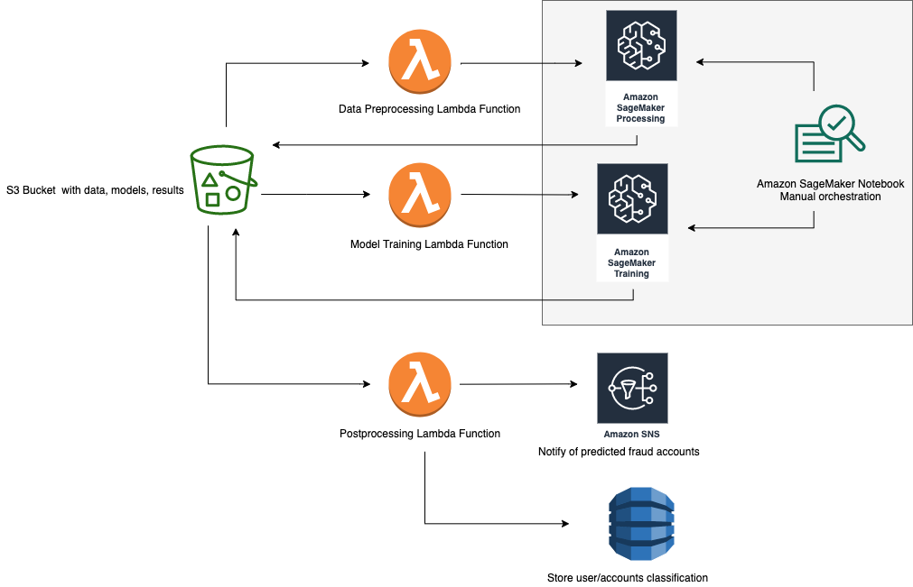

# Amazon SageMaker and Deep Graph Library for Fraud Detection in Heterogeneous Graphs

This project shows how to use [Amazon SageMaker](https://aws.amazon.com/sagemaker/) and [Deep Graph Library (DGL)](https://www.dgl.ai/) to train a graph neural network (GNN) model to detect malicious or fraudulent accounts or users. See the [project wiki](https://github.com/awslabs/sagemaker-graph-fraud-detection/wiki) to learn more about the techniques used.

## Project Organization
The project is divided into two main modules that preprocess the data and train the GNN respectively.

The [first module](source/sagemaker/data-preprocessing) uses [Amazon SageMaker Processing](https://docs.aws.amazon.com/sagemaker/latest/dg/processing-job.html) to do feature engineering and extract edgelists from a table of transactions or interactions.

The [second module](source/sagemaker/dgl-fraud-detection) shows how to use DGL to define a GNN model and train the model using [Amazon SageMaker training infrastructure](https://docs.aws.amazon.com/sagemaker/latest/dg/deep-graph-library.html).

The [jupyter notebook](source/sagemaker/dgl-fraud-detection.ipynb) shows how to run the full project on an [example dataset](https://linqs-data.soe.ucsc.edu/public/social_spammer/).

The project also contains a [cloud formation template](deployment/sagemaker-graph-fraud-detection.yaml) that deploys the code in this repo and all AWS resources needed to run the project in an end-to-end manner in the AWS account it's launched in.

## Getting Started

To get started quickly, use the following quick-launch link to deploying the resources in this project.

| Region | Stack |
| ---- | ---- |
|US West (Oregon) |   |

To launch the stack, enter a name in the **Bucket Name** field under S3 configurations, check the box to acknowledge creation of IAM resources, and click Create Stack.

Once the stack is created, go to the Outputs tab and click on the SageMakerNotebook link. Once the notebook opens you can run then run each cell in the notebook

## Architecture

The project architecture deployed by the cloud formation template is shown here.

## Contents

* `deployment/`
  * `sagemaker-graph-fraud-detection.yaml`: Creates AWS CloudFormation Stack for solution
* `source/`
  * `lambda/`
    * `data-preprocessing/`
      * `index.py`: Lambda function script for invoking SageMaker processing
    * `graph-modelling/` 
      * `index.py`: Lambda function script for invoking SageMaker training
  * `sagemaker/`
    * `baselines/`
      * `graph-fraud-baseline.ipynb`:  Jupyter notebook for a baseline method using just the graph structure
      * `mlp-fraud-baseline.ipynb`:  Jupyter notebook for feature based MLP baseline method using SageMaker and MXNet
      * `mlp_fraud_entry_point.py`: python entry point used by the MLP baseline notebook for MXNet training/deployment
      * `xgboost-fraud-entry-point.ipynb`: Jupyter notebook for feature based XGBoost baseline method using SageMaker
    * `data-preprocessing/`
      * `container/`
        * `Dockerfile`: Describes custom Docker image hosted on Amazon ECR for SageMaker Processing
        * `build_and_push.sh`: Script to build Docker image and push to Amazon ECR
      * `graph_data_preprocessor.py`: Custom script used by SageMaker Processing for data processing/feature engineering
    * `dgl-fraud-detection/`
      * `data.py`: Contains functions for reading node features and edgelists into DGL Graphs
      * `model.py`: Implements the various graph neural network models used in the project
      * `requirements.txt`: Describes Python package requirements of the Amazon SageMaker training instance
      * `sampler.py`: Contains functions for graph sampling for mini-batch training
      * `train_dgl_entry_point.py`: python entry point used by the SageMaker DGL notebook for GNN training
    * `dgl-fraud-detection.ipynb`: Orchestrates the solution. Triggers preprocessing and model training

## License

This project is licensed under the Apache-2.0 License.

