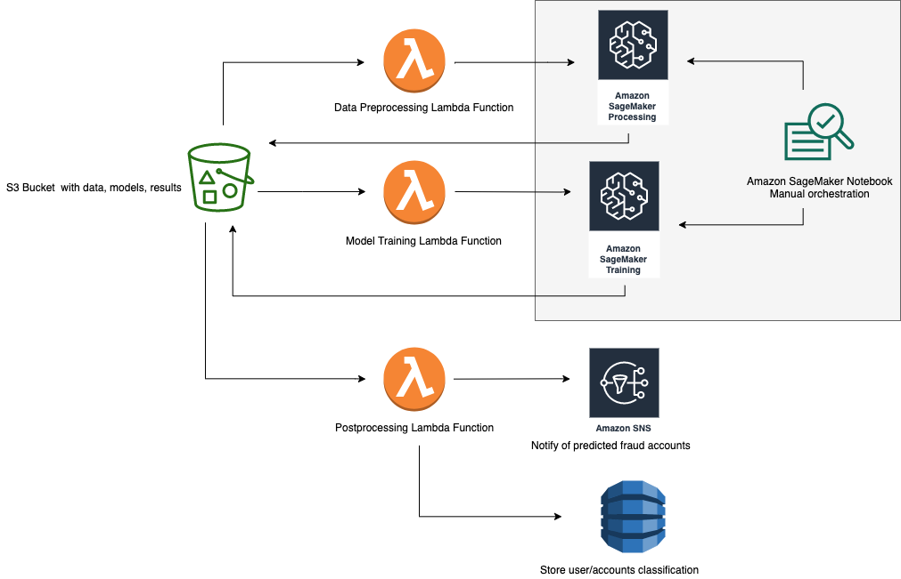

# Amazon SageMaker and Deep Graph Library for Fraud Detection in Heterogeneous Graphs

Many online businesses lose billions annually to fraud, but machine learning based fraud detection models can help businesses predict what interactions or users are likely fraudulent and save them from incurring those costs. 

In this project, we formulate the problem of fraud detection as a classification task on a heterogeneous interaction network. The machine learning model is a Graph Neural Network (GNN) that learns latent representations of users or transactions which can then be easily separated into fraud or legitimate.

  

This project shows how to use [Amazon SageMaker](https://aws.amazon.com/sagemaker/) and [Deep Graph Library (DGL)](https://www.dgl.ai/) to construct a heterogeneous graph from tabular data and train a GNN model to detect fraudulent transactions in the [IEEE-CIS dataset](https://www.kaggle.com/c/ieee-fraud-detection/data).

See the [details page](docs/details.md) to learn more about the techniques used, and the [online webinar](https://www.youtube.com/watch?v=P_oCAbSYRwY&feature=youtu.be) or [tutorial blog post](https://aws.amazon.com/blogs/machine-learning/detecting-fraud-in-heterogeneous-networks-using-amazon-sagemaker-and-deep-graph-library/) to see step by step explanations and instructions on how to use this solution.

## Getting Started

To get started quickly, use the following quick-launch link to create a CloudFormation stack and deploy the resources in this project.

| Region | Stack |
| ---- | ---- |
|US East (N. Virginia) |   |
|US East (Ohio) |   |
|US West (Oregon) |   |

On the stack creation page, verify that the **Launch Classic SageMaker Notebook Instance** field under SageMaker configurations is set to 'true', check the boxes to acknowledge creation of IAM resources, and click **Create Stack**.

Once the stack is created, go to the Outputs tab and click on the SageMakerNotebook link. This will open up the jupyter notebook in a SageMaker Notebook instance where you can run the code in the notebook.

## Architecture

The project architecture deployed by the cloud formation template is shown here.

## Project Organization
The project is divided into two main modules.

The [first module](source/sagemaker/data-preprocessing) uses [Amazon SageMaker Processing](https://docs.aws.amazon.com/sagemaker/latest/dg/processing-job.html) to do feature engineering and extract edgelists from a table of transactions or interactions.

The [second module](source/sagemaker/sagemaker_graph_fraud_detection/dgl_fraud_detection) shows how to use DGL to define a GNN model and train the model using [Amazon SageMaker training infrastructure](https://docs.aws.amazon.com/sagemaker/latest/dg/deep-graph-library.html).

The [jupyter notebook](source/sagemaker/dgl-fraud-detection.ipynb) shows how to run the full project on an [example dataset](https://www.kaggle.com/c/ieee-fraud-detection/data).

The project also contains a [cloud formation template](deployment/sagemaker-graph-fraud-detection.yaml) that deploys the code in this repo and all AWS resources needed to run the project in an end-to-end manner in the AWS account it's launched in.

## Contents

* `deployment/`
  * `sagemaker-graph-fraud-detection.yaml`: Creates AWS CloudFormation Stack for solution
* `source/`
  * `lambda/`
    * `data-preprocessing/`
      * `index.py`: Lambda function script for invoking SageMaker processing
    * `graph-modelling/` 
      * `index.py`: Lambda function script for invoking SageMaker training
  * `sagemaker/`
    * `baselines/`
      * `mlp-fraud-baseline.ipynb`:  Jupyter notebook for feature based MLP baseline method using SageMaker and MXNet
      * `mlp_fraud_entry_point.py`: python entry point used by the MLP baseline notebook for MXNet training/deployment
      * `utils.py`: utility functions for baseline notebooks
      * `xgboost-fraud-entry-point.ipynb`: Jupyter notebook for feature based XGBoost baseline method using SageMaker
    * `data-preprocessing/`
      * `container/`
        * `Dockerfile`: Describes custom Docker image hosted on Amazon ECR for SageMaker Processing
        * `build_and_push.sh`: Script to build Docker image and push to Amazon ECR
      * `graph_data_preprocessor.py`: Custom script used by SageMaker Processing for data processing/feature engineering
    * `sagemaker_graph_fraud_detection/`
      * `dgl_fraud_detection/`
        * `model`
          *  `mxnet.py`: Implements the various graph neural network models used in the project with the mxnet backend
        * `data.py`: Contains functions for reading node features and labels
        * `estimator_fns.py`: Contains functions for parsing input from SageMaker estimator objects
        * `graph.py`: Contains functions for constructing DGL Graphs with node features and edge lists
        * `requirements.txt`: Describes Python package requirements of the Amazon SageMaker training instance
        * `sampler.py`: Contains functions for graph sampling for mini-batch training
        * `train_dgl_mxnet_entry_point.py`: python entry point used by the notebook for GNN training with DGL mxnet backend
        * `utils.py`: python script with utility functions for computing metrics and plots
      * `config.py`: python file to load stack configurations and pass to sagemaker notebook
      * `requirements.txt`: Describes Python package requirements of the SageMaker notebook instance
      * `setup.py`: setup sagemaker-graph-fraud-detection as a python package
    * `dgl-fraud-detection.ipynb`: Orchestrates the solution. Triggers preprocessing and model training
    * `setup.sh`: prepare notebook environment with necessary pre-reqs

## License

This project is licensed under the Apache-2.0 License.

